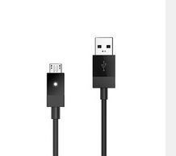
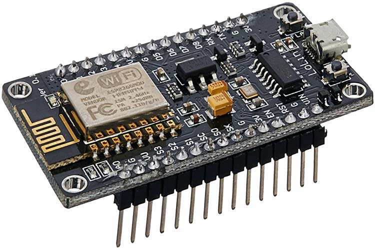
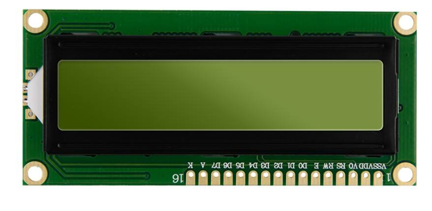
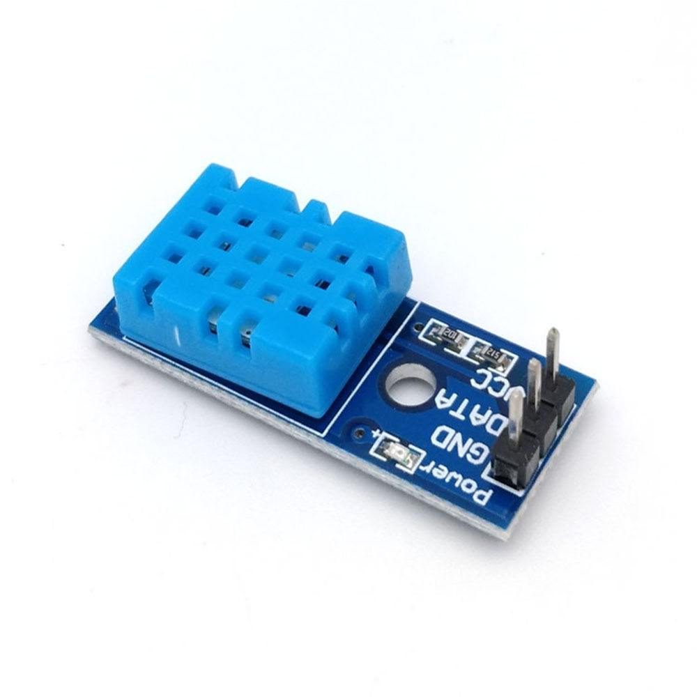

# Qualcomm® CM2290 Open Kits WIFI-HygroThermoGraph-demo Developer documentation

## Introduce

This project relies on the CM2290 development kit and makes full use of its diverse and powerful connection capability. By enabling AP WIFI through HostAPD and UDHCPD tools, temperature and humidity data transmission is completed via mosquitto. After the development board opens the wifi hotspot and runs the mosquitto service, the hyhumidity meter will actively connect to the wifi and report the data. Temperature and humidity data can be viewed on a simple web page.

CM2290 development board can be used for the development of sweeping robot. Environmental monitoring ability is one of the basic abilities of sweeping robot, which is used for the robot to perceive the external environment and make responses.

This project can be used to detect the temperature of the home environment. With small modifications, multiple hygrometers can be connected simultaneously to monitor the temperature and humidity changes of the entire environment.

The project was built in x86 host with across complier tool and has been tested in Qualcomm® CM2290 Open Kits.

Qualcomm® CM2290 SoC Open Kits


## Materials and Tools used for the project

1. Hardware materials

Except for the Open Kits,The following hardware materials are also needed:

* Type-C usb line

using the usb line to develop on Qualcomm® CM2290 SoC Open Kits.



* Charger

Direct power supply for Qualcomm® CM2290 SoC Open Kits.


* ESP8266
The lower machine device is used to connect to wifi and upload data through mqtt protocol.



* LCD1602
LCD1602 liquid crystal display (LCD) is a widely used character LCD module.



* DHT11
DHT11 is a temperature and humidity sensor with calibrated digital signal output. Its precision humidity ±5%RH, temperature ±2℃, range humidity 5~95%RH, temperature -20~+60℃.




## Environment configuration

This section mainly describes the source and configuration of some open source projects or third-party tools needed in the development process.

### Mosquitto for MQTT
[Mosquitto](https://mosquitto.org/) <br>
Mosquitto is an open source messaging broker that implements MQTT protocol versions 3.1 and 3.1.1. The compact is lightweight and suitable for all devices from low-power single-board computers to full servers.

## Configure and Usage
Start the CM290 and connection CM290 to host by Type-c usb.
### 1. Configure
conf directory provides the configuration files used in the project.

### 2. Usage
mosquitto.tar.xz is built for the CM2290 aarch platform,push it to the development board, extract to the root directory, and use the mosquitto tool.

```
tar -xvf mosquitto.tar.xz -C /
sh ap-wifi.sh
mosquitto -c mosquitto.conf
```